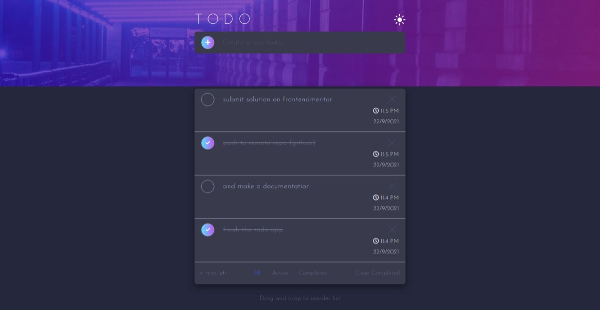

# Frontend Mentor - Todo app solution

This is a solution to the [Todo app challenge on Frontend Mentor](https://www.frontendmentor.io/challenges/todo-app-Su1_KokOW). Frontend Mentor challenges help you improve your coding skills by building realistic projects. 

## Table of contents

- [Overview](#overview)
  - [The challenge](#the-challenge)
  - [Screenshot](#screenshot)
  - [Links](#links)
- [My process](#my-process)
  - [Built with](#built-with)
  - [What I learned](#what-i-learned)
  - [Useful resources](#useful-resources)
- [Author](#author)
- [Acknowledgments](#acknowledgments)

## Overview

The todo app challenge is designed to equip the task handler with data manipulating skills while handling different use cases, storing the todo data on the user browser to enable todo data retention else being deleted by user and finally draggable todo list reordering while keeping track of time when a todo task is created.

### The challenge

Users should be able to:

- View the optimal layout for the app depending on their device's screen size
- See hover states for all interactive elements on the page
- Add new todos to the list
- Mark todos as complete
- Delete todos from the list
- Filter by all/active/complete todos
- Clear all completed todos
- Toggle light and dark mode
- **Bonus**: Drag and drop to reorder items on the list

### Screenshot

### Links

- Solution URL: [Github link](https://github.com/code-pace/todo-app)
- Live Site URL: [todo-app](https://github.com/code-pace/todo-app)

## My process

### Built with

- Semantic HTML5 markup
- CSS custom properties
- Flexbox
- CSS Grid
- Desktop-first workflow
- [React](https://reactjs.org/) - JS library

**Note: These are just examples. Delete this note and replace the list above with your own choices**

### What I learned

The Todo app challenge gave me better insight on state handling from learning how to interact with object array using the map and filter javascript functions I was sort and loop through arrays, the drag and drop feature using the react-beautiful-dnd package through yarn and finally how to store data on browser using the local storage api.

### Useful resources

- [Build a todo app by DevEd](https://www.youtube.com/watch?v=pCA4qpQDZD8&t=4671s) - This helped me add a feature of storing on user browser using local storage api.
- [How to Add Drag and Drop in React with React Beautiful DnD](https://www.freecodecamp.org/news/how-to-add-drag-and-drop-in-react-with-react-beautiful-dnd/?__cf_chl_captcha_tk__=pmd_j3B3PFoA6LKBjy5mf73zfGrAZaUd5v.mNmPj101pPeE-1632350181-0-gqNtZGzNAxCjcnBszQf9) - This is an amazing article by Colby Fayock which helped me finally understand the react drag and drop. I'd recommend it to anyone still learning this concept.

## Author

- Website - [todo-App](https://code-pace.github.io/todo-app/)
- Frontend Mentor - [@code-pace](https://www.frontendmentor.io/profile/code-pace)
- Twitter - [@code_pace](https://www.twitter.com/code_pace)

## Acknowledgments

I owe a hat to devEd for his great intuitive youtube tutorial on react projects including the todo-app his approach in handling users todo data by saving it on their browser using the local storage api, also to colby Fayock for simple breakdown of the react DnD feature which made the app fun to interact with and finally to frontendmentor for organizing a portofolio project for both beginners and senior frontend developers.

